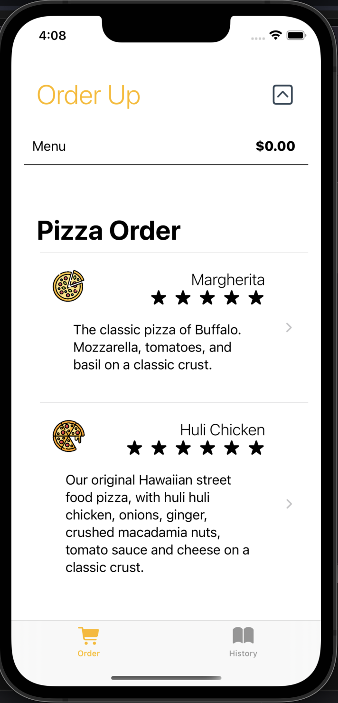
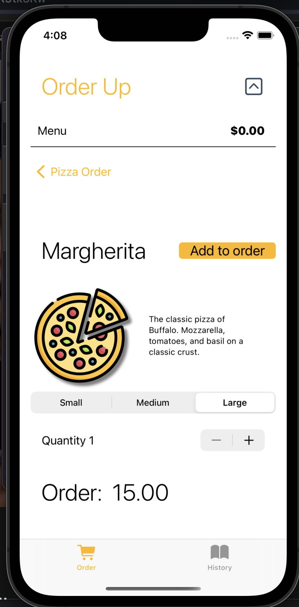
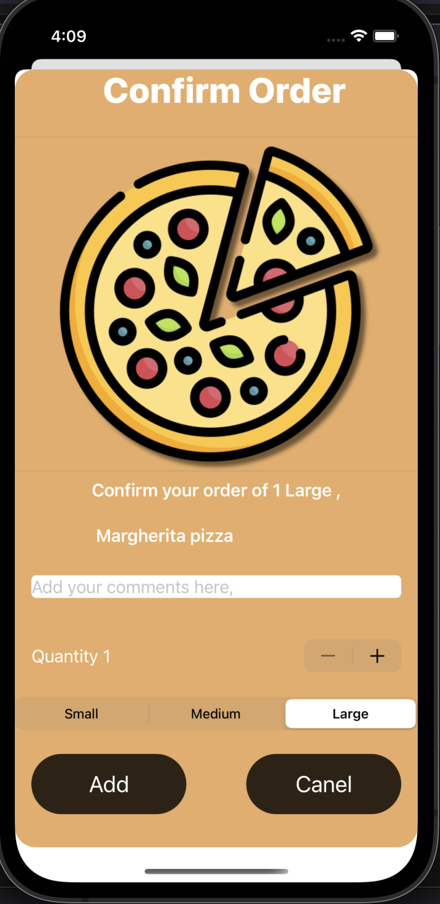
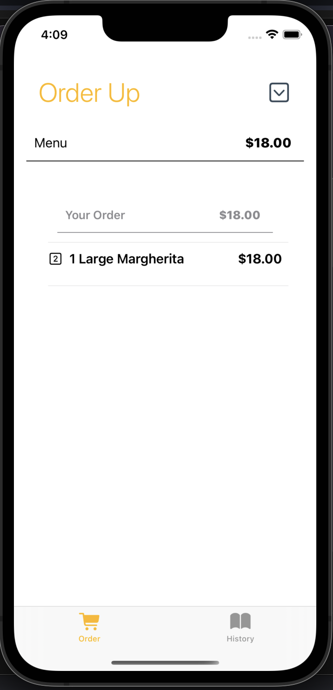
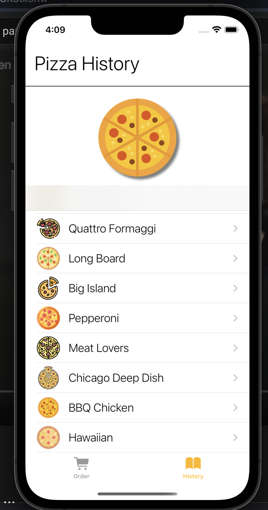
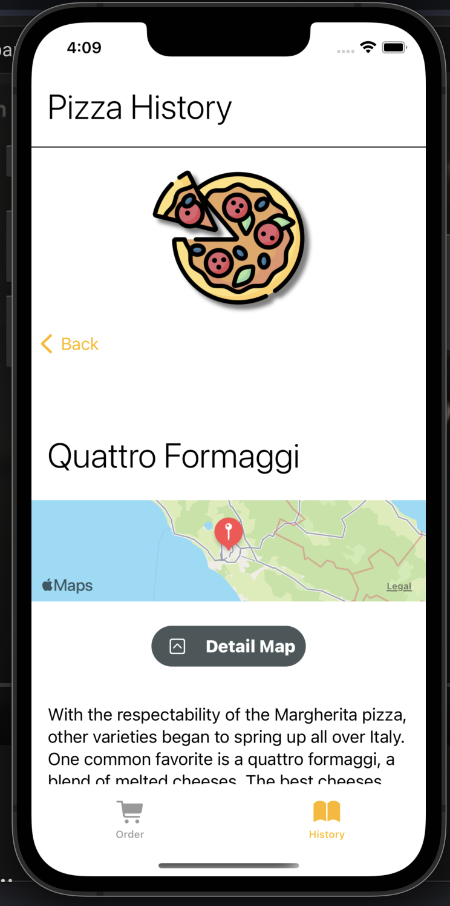

# Pizza Demo

## Screenshots

## Description 
*With the help of an (SwiftUI Essentials Training) LinkedIN learning course*

This app allows you to order an item and add a comment to your pizza order.
It also allows you to use swipe gestures to cancel an order you've made by swiping to the left .
This app also features a history page where you can see the history of a pizza and where it's most prominent. 

### Purpose of doing this 
The purpose of doing this app was to learn more about swiftUI and concepts needed to create a app, It also helped me see on how to write better code and see how to solve problems in a modular way. 

### Lessons Learned 
- Modular design when creating or adding features to an app
- Using Combine (on a basic level)
- Environment variables.
- Porting swiftui to storyboard using hosting controllers

### Challenges 
- Binding and States
- Using the Identifiable protocol in the right scenarios 
- Geometry readers 

